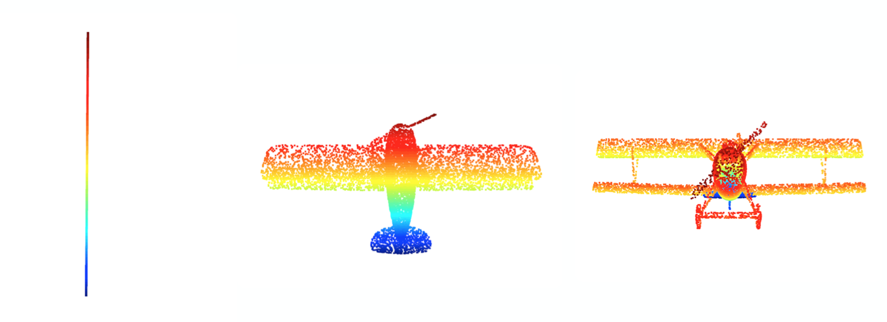
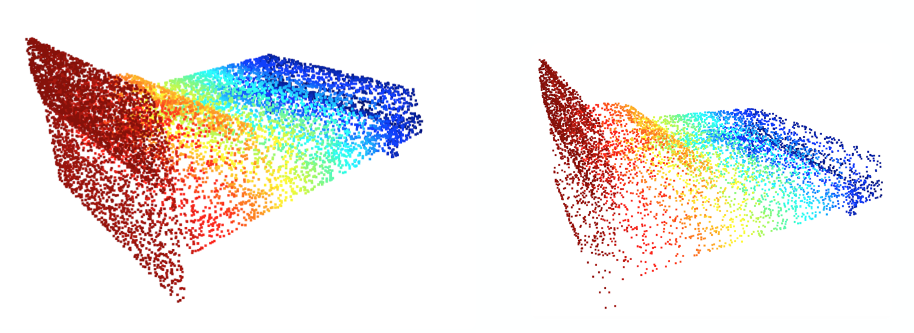
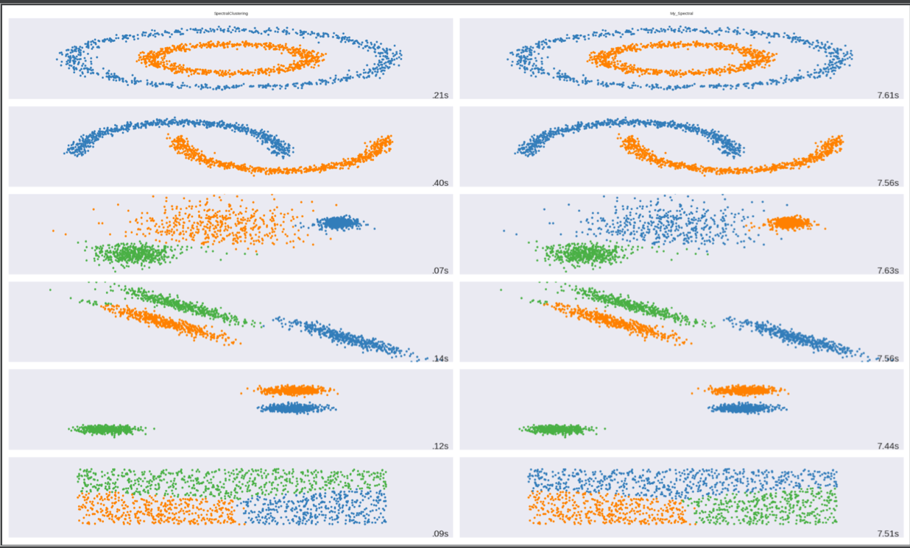
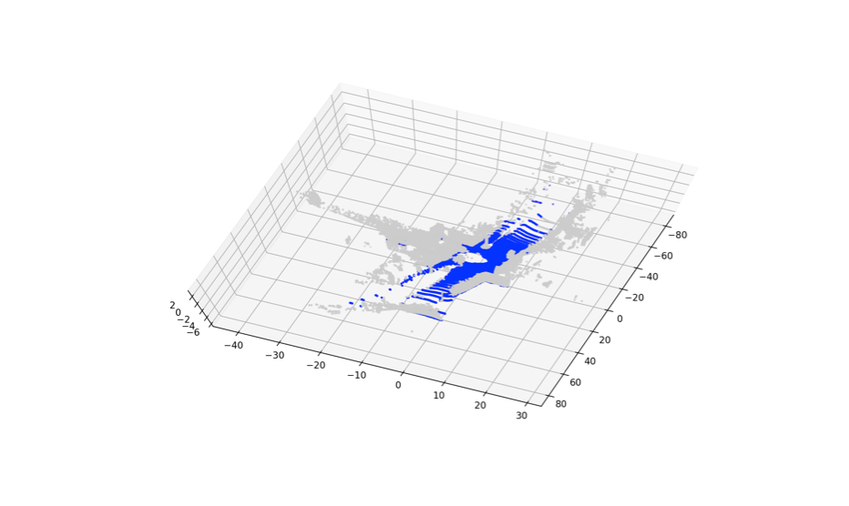
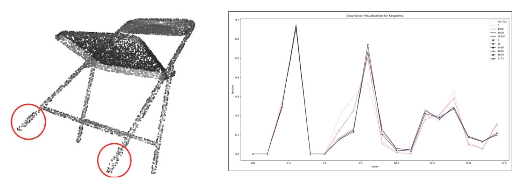

# pointcloud-basic-processing
关于点云的一些基础性、传统处理方法的学习实现和总结，希望能帮助到大家～

数据集主要包括：ModelNet40、KITTI

主要对以下算法进行学习和实现:

- [PCA](https://github.com/adrien-Chen/pointcloud-basic-processing/tree/master/pca)

  - 对ModelNet40数据做PCA

  

  - 对ModelNet40数据做voxel filter

- [Nearest Neighbors Algorithm](https://github.com/adrien-Chen/pointcloud-basic-processing/tree/master/nearest-neighbors)

  - KD-Tree实现
  - Octree实现
  - KNN、Radius-NN实现

- [Clustering](https://github.com/adrien-Chen/pointcloud-basic-processing/tree/master/clustering)

  - K-means
  - GMM
  - Spectral

  compare ours implements with sklearn：show spectral like this

  

- [Model Fitting](https://github.com/adrien-Chen/pointcloud-basic-processing/tree/master/model-fitting)

  - LSQ（最小二乘法）
  - RANSAC
  - 实现简单的地面分割（[more results](https://github.com/adrien-Chen/pointcloud-basic-processing/tree/master/model-fitting/result-imgs)）

- [Feature Extraction](https://github.com/adrien-Chen/pointcloud-basic-processing/tree/master/feature-extraction): 
  - implete ISS
- [Feature Description](https://github.com/adrien-Chen/pointcloud-basic-processing/tree/master/feature-description)  
  - implete FPFH

- [Supplementary](https://github.com/adrien-Chen/pointcloud-basic-processing/tree/master/supplementary-notes)
  - 数学基础
  - GNN简介
  - 知识点总结

